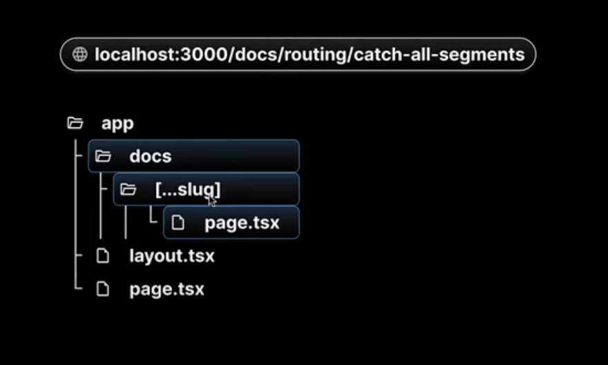

## Routing

- Nextjs has a file system based routing mechanism.
- URL paths that users access in the browser are defined by files and folders in codebase.
- Not every file corresponds to a route in codebase, we need to follow a convention.

## Routing Conventions

- All routes must be placed inside app folder
- Every file that corresponds to a route must be named Page.js or Page.tsx
- Every folder corresponds to a path segment in browser url

When these conventions are followed the file automatically becomes a route

1. page.tsx file inside app folder maps to route of your domain
2. Although we deleted this layout.tsx file, nextjs automatically creates and populates it when we load the route route
3. nextjs will automatically respond with 404 in case of non matching route, we don't have to explicitly handle non matching route.


## Nested Routes

1.By creating a nested folder structure, it will route in the same way in the url


http://localhost:3000/blog

http://localhost:3000/blog/first

http://localhost:3000/blog/second

## Dynamic Routes

1. While creating nested folders is ok for now but it is not always feasible to define routes using predefined paths especially for complex applications.
2. In nextjs we can enclose a folder name with brackets to create a dynamic route.
3. nextjs treats square brackets in a folder name as a dynamic segment enabling us to create dynamic routes.

Every page in the app router receives route parameters as a prop. Lets destructure it as params. The params object contains the route parameters as key value pairs

http://localhost:3000/products

http://localhost:3000/products/1

http://localhost:3000/products/100


## Nested Dynamic Routes

It is possible to create nested dynamic routes by having dynamic segments in the folder names.


This is a [Next.js](https://nextjs.org/) project bootstrapped with [`create-next-app`](https://github.com/vercel/next.js/tree/canary/packages/create-next-app).

## Catch all Segments

1. this file is match any URL that contains the doc segment in the path. Catch all segment routes captures all URL segments and maps them to this single file in our project
2. This is particularly useful for documentation where we want different segments for better organization and SEO but the layout of the documentation remains the same.

http://localhost:3000/docs/

http://localhost:3000/docs/feature1/

http://localhost:3000/docs/feature1/content1

http://localhost:3000/docs/feature1/content1/feature1



## Catch all Route

- Nextjs provides optional catch all routes feature as well. Currently http://localhost:3000/docs/ will result is 404 page. To display the same docs home page nextjs provides optional catch all route. Just wrap square brackets with another pair of square brackets.

## Not Found Page

1. By default in any any nextjs application when you navigate to a router that is not defined in the app folder, nextjs renders a default 404 not found page.
2. For this just create a not-found.tsx or not-found.js file in the app folder.
3. This not found page is tied to the file based routing mechanism of the app router.
4. not found pages can also be define at the folder level.

## File Colocation

1. Although nextjs provide routing conventions to follow, it remains flexible regarding how you structure your project files and folders.
2. nextjs uses file system based router where each folder represents a route segment mapped to a corresponding segment in the URL.
3. A router isn't publicly accessible until a page.js or page.tsx is added to the respective route segment.
4. Moreover even when a route becomes publicly accessible only the content returned by the page.tsx is sent to the client. The content returned must be a default exported react component.
5. Although you can collocate your project files within the app directory, it is not mandatory if you prefer you can keep them outside the app directory within the src folder

## Private Folders

A private folder indicates that it is a private implementation detail and should not considered for the routing system. This means that the folder and all its subfolders are excluded from routing.

To create a private folder simply prefix the folder name with an underscore. Within this folder you can have utility functions. Normally page.tsx would correspond to URL however this being inside a private folder making this page.tsx un-routable. If you try to navigate to this folder in url you will get 404 not found error.

private folders can be helpful in a few different scenarios:

- Separating UI logic from routing logic.
- For consistently organizing internal files across a project
- For sorting and grouping files in code editor and
- finally for avoiding potential naming with future Nextjs file conventions.

## Route Groups

- Allows us to logically group our routes and project files without affecting the URL path structure.
- We can mark a folder as route group to exclude it from the routes URL path.
- To create a route group simply wrap folders name in paranthesis. So auth folder should be treated as route group and its name will be omitted from the URL path. auth folder serves as a folder to organize our code.
- We can have multiple levels of nested route groups if needed

## Layouts

- A page is a UI unique that is unique to a route
- A layout is a UI that is shared between multiple pages in the application
- It is common to have common header footer. With layout it is much easier in nextjs
- you can define a layout by default exporting a React component from a layout.jsx or layout.tsx.
- That component should accept a children prop that will be populated with a child page during rendering.
- We won't be creating layout from scratch as nextjs already provides one out of the box. Inside the app folder you can find a layout.tsx. This layout serves as the topmost layout and is referred to as root layout. The root layout is a mandatory layout for every nextjs application. Nextjs automatically generates this file even if we delete it.
- By defining a single layout.tsx file we can create a consistent layout for every page in the application. We have the freedom to add any markup styles or behavior we wish to

## Nested Layouts

- Layouts can be nested.
- We can create layout file specifically for product details page. We can create layout.tsx file in product details folder

## Route group layout

- To selectively apply a layout to certain segments while leaving others unchanged.
- Route groups allows us to opt specific segments into a layout without altering the URL.

## Routing MetaData

- Ensuring proper SEO is crucial for increasing visibility and attracting users.
- Nextjs introduced the MetaData API which allows us to define MetaData for each page.
- Metadata ensures accurate and relevant information is displayed when your pages are shared or indexed.
- Export a static metadata object or a dynamic generateMetadata function
- Both layout.tsx and page.tsx can import metadata. If applied in a layout it applies to all pages in that layout, but if defined in a page, it applies only to that page.
- MetaData is read from root level to the final page level
- When there is metadata in multiple places for the same route, they get combined, but page metadata will replace layout metadata if they have the same properties.
- Both layout and page can have metadata but page metadata takes precedence if both are present.
- When multiple segments in a route export metadata object the properties are merged to form the final metadata object. During merging the deepest segment takes priority
- Dynamic metadata depends on dynamic information such as the current route parameters, external data or metadata in the parent segments.
- To define dynamic metadata we export a generic metadata function that returns a metadata object from a layout or page.tsx file
- A very common case for dynamic metadata would be a dynamic route like product ID. If we use a static metadata object for /product/id the page title should be the same for every product, however for a e commerce site it is essential to have a unique title for each product.
- generateMetadata can also be defined as a async function
- We cannot export both the metadata object and generateMetadata function from the same route segment.

## title metadata

- title field's primary purpose is to define the document title.
- It can be either a string or object.
- title.default property is useful when you want to provide a fallback title for child route segments, they don't explicitly specify a title
- If a child route segment such as a blog/page.tsx doesn't have a title defined it will fallback to the default title
- to create dynamic titles by adding a prefix or suffix you can use title.template property. This property applies to child route segments and not the segment in which it is defined.
- absolute title : if you want to provide a title that completely ignores title.template set in the parent segments you can use title.absolute property.

## Link Component Navigation

- To enable client side navigation nextjs provides us with link component. The Link component is a react component that extends HTML anchor element and it is the primary way to navigate between routes in nextjs.
- replace prop replaces the current history state instead of adding new URL to the stack

## Active Links

- To determine if a link is active nextjs provides the withPathName hook.
- All React components are server components by default and hooks can only be used inside client components.
- withPathName hook returns the path in the URL.

## Navigating Programmatically

- useRouter only works in client side.
- If you want to replace the history instead of pushing the route onto the stack you can use router the replace.
- We can use router.back() without any arguments to navigate back to the previous page in the browser's history stack.
- You can also use router.forward() to navigate forward to the next page.

## Templates

- layouts only mount the part representing the content of the newly loaded page but keep all the common elements untouched. layout don't mount shared components resulting in the better performance. A majority of the time this is behavior you need.
- however you might come across a scenario where you need the layouts to create a new instance for each of the children on navigation. For such situations you can use the template file as replacement of the file.
- Templates are similar to layouts in that they wrap each child layout or page, But with templates when a user navigates between routes that share a template, a new instance of the component is mounted, DOM elements are recreated, state is not preserved and effects are re-synchronized.
- A template can be defined by exporting a default React component from a template.tsx or .jsx file
- Similar to layouts, templates also should accept a children prop which will render the nested segments in the route.
- It is possible to include both layout.tsx and template.tsx. In such a scenario the layout renders first, the layout's children is replaced by the component exported from the template files.

## Loading UI

- So far we came across several special files page.tsx, template.tsx, layout.tsx, and not-found.tsx
- loading.tsx file allows us to create loading states that are displayed to the users while a specific route segment's content is loading. The loading state appears immediately upon navigation, giving users the assurance that the application is responsive and actively loading content.
- To create a loading state you simply need to add a loading.tsx file to the designated folder. This file will automatically wrap page.tsx file and all its nested children within a React suspense boundary.
- Using loading.tsx file you can display the loading state as soon as user navigates to the new route. The immediate feedback reassures users that their action has been acknowledged, reduces perceived loading times perceived loading times and makes the application feel more responsive.
- Nextjs allows the creating of shared layouts that remain interactive while new route segments are loading. Meaning users can continue interacting with certain parts of the application while such as navigation menu or sidebar even if the main content is still being fetched. By following loading the loading UI convention, you ensure that loading states don't obstruct the functionality of shared layouts, providing a smooth uninterrupted user experience.

## Error Handling

- error.tsx must a client component
- error.tsx automatically wraps a route segment and its nested children is a react error boundary. Create error UI tailiored to specific segments using the file system hierarchy to adjust granularity.
- Isolate errors to affected segment while keeping the rest of the application functional.
- Add functionality to attempt to recover from an error without a full page reload.


## Recovering from Errors

- ErrorBoundary defined in error.tsx comes with a handy prop. It receives a reset function which we can destructure along with error object
- To ensure that we can recover on client side we need to convert our Page.tsx to client component as well.
- Executing the reset function attempts to render the error boundaries contents. If successful the fallback error component is replaced with the re-rendered content from page.tsx

## Handling Errors in Nested Routes

- Error bubble up to the closest parent error boundary.
- This implies that error.tsx file will cater to errors for all its nested child segments.
- By positioning the error.tsx at different levels in the nested folders of the route, you can achieve a more granular level of error handling.
- If we move error.tsx file to the products folder, we see the error message but however this time entire products route is replaced with the UI from the error.tsx file. The error from the page.tsx file from the reviewId folder bubbles us to the nearest error boundary which is now defined in the error.tsx file in the products folder.

## Handling Errors in Layouts

- An error.tsx will handle errors for all its nested child segments.
- However there is a nuance when it comes to layout.tsx component within the same segment. The error boundary doesn't catch errors thrown here because it is nested inside the layouts components.
- The visual representation of the component hierarchy for a given segment you will see that the layouts sit above the error boundary.
- The error boundary will not handle errors thrown errors thrown in a layout.tsx component within the same segment. To overcome this we need to place the error.tsx file in the layout's parent segment.
- The placement of the error.tsx file plays a pivotal role in managing errors efficiently across different segments of our application.

## Parallel Routes

- Parallel Routes are advanced routing mechanism that allows for the simultaneous rendering of multiple pages within the same layout.
- Parallel Routes are defined in Next.js using a feature known as slots.
- Slots help structure our component in a modular fashion.
- To define a slot we use @folder naming convention.
- Each slot is then passed as a prop to its corresponding layout.tsx file.
- Each slot is automatically passed to the layout.tsx component as a prop which we can then use to structure the dashboard page.
- The slots users, revenue and notifications are available as props and we don't have to import them.
- slots are not route segments and don't affect the URL structure. /complex-dashboard/users or /complex-dashboard/@users result into 404 not found.
- Benefit of parallel route is their ability to split a single layout into various slots making the code more manageable. This is particularly advantageous when different teams work on different sections of the page.
- Of course this is the same with the traditional component composition as well. The true benefit of parallel routes lies in the capacity for independent route handling and sub navigation.
- Parallel routes handle each route independently. This means that each slot of your layout such as user analytics or revenue metrics or can have its own loading and error states. This granular constrol is particularly beneficial in scenarios where different sections of the page load at varying speed or encounter unique errors.
- Parallel routes allows simultaneous rendering of different pages within the same layout.


## Unmatched Routes

- Sub-navigation within routes is one of the benefits of using parallel routes. In case of our complex dashboard a use case will be navigation a default list of notifications and an archive list of notifications.
- when navigating to http://localhost:3000/complex-dashboard/archived only the notifications slot has the matching route, the other 3 slots children users and revenue become unmatched.
- When dealing with a unmatched slot the content rendered by nextjs depend on the routing approach.
- In the case of navigation within the UI, nextjs retain the previously active state of slot regardless of the changes in the URL. Meaning when we navigate between default notifications and archived notifications, the other slots children revenue and user remain unaffected. These slots continue to display whatever content they were showing before and are not influenced by the shift in the URL path.
- In case of Page reload nextjs immediately searches for a default.tsx file within each unmatched slot. The presence of this file is is critical as it provides the default content nextjs will render in the user interface. If this default.tsx file is missing in any of the unmatched slots in the current route then nextjs will render a 404 error
- http://localhost:3000/complex-dashboard/archived will render 404 as there is not default.tsx file in children or user or revenue slots.
- The default.tsx file in Nextjs serves as fallback to render content when the framework cannot retrieve a slots active state from the current URL. You have complete freedom to define the UI for unmatched routes. You can either mirror the content found in page.tsx or craft an entirely custom view.
- So in our case we have to include default.tsx files into 3 unmatched slots

## Conditional Routes

- Parallel routes offer a way to implement conditional routing for example based on the user's authentication state you can choose to render the dashboard for authenticated users or a login page for those who are not authenticated. This is powerful as it enable fully separated code on the same URL.
- We need to create a login slot.
- This login slots also benefits from independent error and loading states as well as sub-navigation to a possible sign-up or forgot password route.

## Intercepting Routes

- Intercepting routes allow you to intercept or stop the default routing behavior to present an alternative view or component when navigating through the UI, while still preserving the intended route for scenarios like page reloads
- This can be useful if you want to show a route while keeping the context of the same page.
- Clicking on the login button normally takes you to a full login page but however with intercepting routes you can configure the application to display a login modal instead while the URL is still updated to reflect the /login route. This ensures link remains shareable. If the page is reloaded or someone accesses the page using the shared link this full login is displayed as expected.
- Similarly in a photo feed application where users can browse through a list of images, clicking on a photo would navigate users to a new page dedicated to that image. With intercepting routes clicking on a photo opens a model within the feed displaying an enlarged photo and details. The url updates to reflect the selected photo so that it becomes shareable.
- Direct URL access or page reloads still lead to a full page view of the photo.
- To create an intercepting route at the same level we use a dot within parantheses notation in a folder name so called F1 directory.
- f2 and intercepting f2 folders are on the same level. It is possible to match segments 1 level above convention is to prefix the folder name with 2 dots.
- (.) to match segments on the same level.
- (..) to match segments one level above.
- (...) to match segments from the root app directory.
- (...) is needed if we have to intercept the about route from f4 level.

## Parallel Intercepting Routes

- Since we want a modal that will render on top of the current feed we need a parallel route first. So within the photo-feed folder we will create @modal as a parallel route and include a layout.tsx file along with children slots

```bash
npm run dev
# or
yarn dev
# or
pnpm dev
# or
bun dev
```

Open [http://localhost:3000](http://localhost:3000) with your browser to see the result.

You can start editing the page by modifying `app/page.tsx`. The page auto-updates as you edit the file.

This project uses [`next/font`](https://nextjs.org/docs/basic-features/font-optimization) to automatically optimize and load Inter, a custom Google Font.

## Learn More

To learn more about Next.js, take a look at the following resources:

- [Next.js Documentation](https://nextjs.org/docs) - learn about Next.js features and API.
- [Learn Next.js](https://nextjs.org/learn) - an interactive Next.js tutorial.

You can check out [the Next.js GitHub repository](https://github.com/vercel/next.js/) - your feedback and contributions are welcome!

## Deploy on Vercel

The easiest way to deploy your Next.js app is to use the [Vercel Platform](https://vercel.com/new?utm_medium=default-template&filter=next.js&utm_source=create-next-app&utm_campaign=create-next-app-readme) from the creators of Next.js.

Check out our [Next.js deployment documentation](https://nextjs.org/docs/deployment) for more details.
