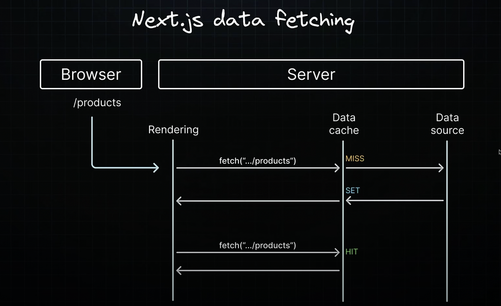
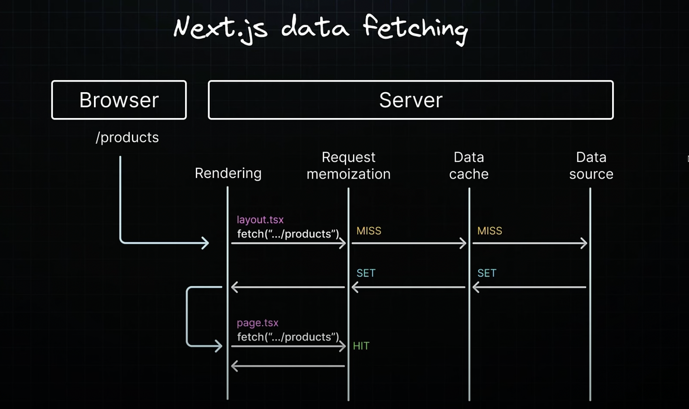

## Fetching Data with Server Components

- The RSC architecture in the app router introduces support for async and await keywords in Server components.
- This allows you to use the familiar JavaScript await syntax by defining your component as an asynchronous function.
- This is the basis for data fetching in server components.

## Loading and Error States

- Traditionally in React, you might manage these states by creating separate variables and conditionally rendering UI based on their values
- However with server components this process becomes more streamlined.
- To implement a loading state, define and export a React component in loading.tsx. For handling errors define and export a React component in error.tsx.
- Error handling components are client components so we need to use "use client" directive at the top.

## JSON Server Setup

- nextjs extends the native fetch API and automatically caches the returned values of fetch. This caching improves caching and reduces costs. Specifically the initial data fetched from the JSON server is stored in what is called a data cache on the server and reused for subsequent requests.
- This eliminates the need to repeatedly query our JSON server. The fact that there is only one request received log statement confirms this default caching behavior of nextjs.

## Data cache

- By default, Nextjs automatically caches the returned values of fetch operations in the data cache in the server.

## Caching data

- What is data cache?: It is a server side cache that persists the result of data fetches across incoming server requests and deployments.
- Data cache improves app performance and reduces costs by eliminating the need to re-fetch data from your data source with every request.

- if we expand the .next folder and inspect the cache folder we see a cache entry corresponding to the user's route from the json placeholder. For subsequent requests nextjs uses the cached response instead of querying JSON placeholders.
- It is also crucial to note the data cache is a server side persistent cache and not the same as the browser cache. So if we visit the same route from a different browser we will still see the cached response from the initial fetch request.

## Opting Out of Caching

- Although caching is a highly effective to optimize data fetching. There are scenarios where you might want to opt out of this default behavior.
- For individual data fetches, you can opt of caching by setting the cache option to no-store. This ensures data is fetched directly from the data source, every time fetch is called.
- Once you specify no-store option for a fetch request, subsequent fetch requests will also not be cached.
- So wise choice if we should place any fetch request we wish to cache before a fetch request set to no-store option.
- 'export const fetchCache = "default-cache";' is a route segment configuration.
- By default Nextjs will cache fetch() requests that occur before any dynamic functions( cookies(), headers(), searchParams()) are used and will not cache requests found after dynamic functions.

## Request Memoization

- Request memoization is a technique that deduplicates requests for the same data within a single render pass.
- This approach allows for re-use of data in a React component tree, prevents redundant network calls and enhances performance.
- For the initial request, data is fetched from an external source and the request is store in memory.
- Subsequent requests for the same data within the same render pass retrieve the result from memory, bypassing the need to make the request again.
- This optimization not only enhances performance but also simplifies data fetching within a component tree.
- When the same data is needed across different components in a route(eg in a layout, Page, multiple components ), It eliminates the need to fetch data at the top of the tree and pass props between components.
- Instead data can be fetched directly within the components that require it, without concerns about performance implications of multiple network requests for the same data.
- Request memoization optimizes performance by not making a additional request and reusing the result from a request higher up in the component tree.
- in our code layout component initiates a fetch request. It checks in memory to see if a request with the same URL and options had already been made. Finding none it checks the data cache which also shows no result and then fetches the data from the data server, stores the result in the data cache and in memory and then returns it to the layout component. When the layout renders it proceeds to render the page component nested inside it. Then the page component initiates the fetch request and since the url and options are same as already in memory, the result of that request is returned to the page component. There is no need to check the data cache nor make an additional request to the data source improving overall performance. This is called request memoization: reusing the results of the requests withing the same render phase
- React memoization is a React feature not specifically a Nextjs feature. React team recently decided to not de duplication fetch requests by default as part of React 19.
- Memoization only applies to GET method in fetch requests.
- Memoization only applies within the React component tree. It doesn't extend to fetch requests in Route handlers as they are not part of the React component tree.
- For some cases where fetch is not suitable (like some database clients, CMS clients, or GraphQl clients ), you can use the React cache function to memoize functions.

## caching in the Nextjs

- By default Nextjs caches all the fetch requests in the data cache, which is a persistent HTTP cache on the server.
- This helps optimize pages such as a blog post where the content rarely changes.
- We can also opt out of caching: 1- by using the cache :"no-store" option in a fetch request. 2-By using a dynamic function before making the fetch request. 3- by using a route segment config like fetch-cache or dynamic.
- A news website is a great example where you want to make sure you are fetching the latest data at all times.

## Revalidation

- Revalidation is the process of purging the data cache and re-fetching the latest data.

## Time base revalidation

- Nextjs automatically revalidates data after a certain amount of time has passed.
- you can set the revalidate route segment configuration to establish the default revalidation time for a layout or page.
- Regarding the revalidation frequency, the lowest revalidate time across each layout and page of a single route will determine the revalidation frequency of the entire route.

## Client-side Data Fetching

- For the most part the data fetching in the server components is what you should be doing in Nextjs.
- Using useEffect and async function in it is traditional way of fetching data in react component before react server components.
