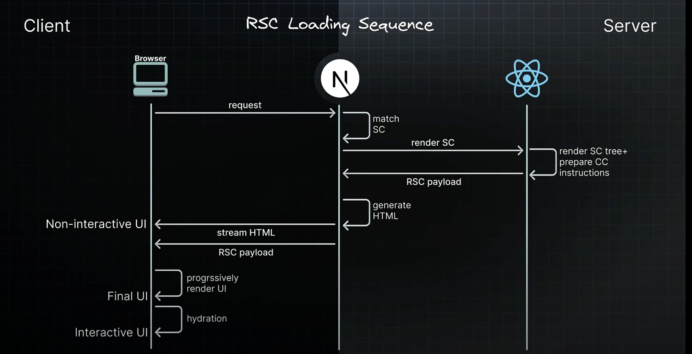

## RSC + Nextjs

- By default every component in nextjs app is considered a server component. This includes the root layout and root page.
- By default we will see console.log prints in terminal rather than browser console.
- Apart from all the benefits server components have their limitations they can't interact directly with browser APIs or handle user interactivity.
- Using useState in these components will throw error because useState expects a client component environment but our about page is a server component. http://localhost:3000/about
- "use client" directive ticket acts a ticket to cross boundary from server to client side and is what allows to define client components. It signals nextjs that this dashboard component page along side any component it imports is intended for client side. As a result component gets full access to browser APIs and ability to handle interactivity.
- console.log prints twice in browser console because of react strict mode. http://localhost:3000/dashboard
- Upon refreshing http://localhost:3000/dashboard we see console.log prints to both browser console and terminal also. Client components are primarily executed in the client and have access to browser APIs but they are also pre rendered once on the server to allow the user to immediately see the page's HTML content rather than a blank screen. It is a optimization strategy nextjs implements and is recommended by React.
- Server components are rendered only on the server.
- Client components are rendered once on the server and then on the client.

## React server component Lifecycle

- For RSC, it is important to consider three elements: Browser(client) and on the server side, Nextjs(the framework) and React (the library).
- Browser requests a page, nextjs app router matches the requested URL to a server component. Nextjs instructs React to render that server component. React renders server component and any child components that are also server components converting them into a special Json format known as the RSC payload. During this rendering if any component suspends, React pauses rendering of the subtree and sends a placeholder value instead. Meanwhile client components are prepared with instructions for later in the life cycle. Nextjs uses the RSC payload which includes the client component instructions to generate HTML on the serve. This HTML is then streamed to the browser to immediately show a fast non -interactive preview of the route. Alongside nextjs streams the RSC payload as React renders each unit of UI. In the browser nextjs processes the streamed React response. React uses the RSC payload and client components instructions to progressively render the UI. Once all the components and the server components output has been loaded, the server UI state is presented to the user. Client components undergo hydration transforming our app from a static display into an interactive experience. This is the initial loading sequence.

## RSC update sequence for parts of the app

- The browser requests a re fetch of a specific ui. Nextjs processes the request and matches it to the required server component. Nextjs instructs react to render the component tree. React renders the components similar to the initial loading. But unlike initial sequence there is no HTML generation for updates. Nextjs progressively streams the response back to the client. On receiving the streamed response nextjs triggers a render of the route using the new output. React reconciles or merges the new rendered output with the existing components on the screen. Since the UI description is a special Json format and not HTML, react can update the DOM while preserving crucial UI updates such as focus or input values.
- This is the essence of the RSC rendering lifecycle with the App router in nextjs.

## 3 types of server rendering strategies

- Static rendering
- Dynamic rendering
- Streaming

## Static Rendering

- Static rendering strategy is where we generate HTML pages at the time of building our application.
- This means all the data and content for web page is prepared in advance. This approach allows the page to be built once, cached by the CDN and served to the client almost instantly.
- This optimization also enables you to share the result of the rendering work among different users, resulting in a significant performance boost for your application.
- Static rendering is particularly useful for blog pages, e commerce product pages, documentation and marketing pages.
- Static rendering is the default rendering strategy in the app router.
- All routes are automatically prepared at build time without additional setup.

## Production server vs development server

- For production an optimized build is created once and you deploy that build.
- A development server focuses on the developer experience. We should be able to make changes in our code and see those changes immediately reflected in the browser. We can't afford to build app once , make changes, rebuild and so on.
- For production builds, a page will be pre-rendered once when we run the build command, however in development mode a page will be pre-rendered or statically rendered for every request.
- "npm run build" command will create a optimized production build of our application, the output folder is once again is the ".next" folder, but this time the content will be different from those of the dev script.
- "npm run build" command displays information about each route in our application with 3 columns: route, size and first load js. "size" refers to the size of the assets downloaded when navigating to the corresponding route client side in the browser. "first load js" refers to the size of assets downloaded when loading the page from the server.
- "first load js" shared by all includes the css from global.css, some runtime code, some framework code, node_modules vendor code like react for example and some code related to the routes and components in our application. This is shown as a separate metric with the overall size.
- Lets say individual route generated "/" the root page which is page.tsx in the app folder with a size of 11.4kb. But when we navigate to the root page in browser both the 11.4 kb and "first load js shared by all" of 87kb both get downloaded resulting in first load js size of 98.4kb.
- for \_not-found page which is 404 not found page has 871B together with "first load js shared by all" of 87kb makes 87.9 kB.
- For our root route "/" which is page.tsx in root folder we can see a hollow circle, this indicates static rendering where the route is automatically pre-rendered at build time as static HTML content. Same is for our 404 not found page, about route and dashboard route. This indication helps us understand which routes are pre-rendered at build time.
- Nextjs generates the build output into the next folder which contains various files and folders essential for serving our application to incoming request from the browser.
- With the server folder we have app folder corresponding to the app router.
- As the build command output shows root and not found as statically generated same we can find as index.html and not_found.html in the app folder.
- Remember even client components are pre-rendered as an optimization step and that is reason we can see client component HTML. As we can see input element in dashboard.html.
- Besides HTML files its important to note the RSC payload for each route. For example we have about.rsc for the about server component and dashboard.rsc for dashboard client component. This special JSON format generated by react for each route is a compact string representation of the virtual DOM. It includes abbreviations, internal references and encoded special meanings. For a server component payload includes the rendered result of the server component like the h1 tag with the text about page. For a client component however the payload includes placeholders or instructions where client components should be rendered along with references to their javascript files. For example for the dashboard route which is a client component contains a reference to the code for the dashboard component. We won't find dashboard page text in the rsc payload but we can find that text in "static/chunks/app/dashboard/page-e8e1e1f0b2e928a3.js". This file contains component code necessary for reconciliation and hydration
- On hard reload in browser after "yarn start" you can see html code in response.
- Apart from HTML in dashboard rsc file is also downloaded. This file is essential for building the UI on the client side when we navigate to "/dashboard" using the link. The component code represented by "static/chunks/app/dashboard/page-e8e1e1f0b2e928a3.js" has also been downloaded. If we navigate to the dashboard route using link, you can verify that component gets rendered without the need to download any additional resources from the server. The initial load includes everything required for client side navigation.

## Prefetching

- Question arises how does nextjs knows to download dashboard component code ahead of time. This is due to a feature known as prefetching in nextjs.
- Prefetching is a technique used to preload a route in the background before the user navigates to it.
- Routes are automatically prefetched as they become visible in the user's viewport, either when the page first loads or as it comes into view through scrolling.
- For static routes, the entire route is prefetched and cached by default.
- When we load the homepage, nextjs prefetches the dashboard route, keeping them ready for instant navigation.
- dashboard.html in the server folder is not downloaded. This file gets served when we directly navigate to "/dashboard" route, then you will directly receive the HTML for the dashboard along with the code shipped to the client for hydration.
- time rendered in the "/about" route remains same irrespective of how many times you refresh the page.

## Dynamic Rendering

- Dynamic rendering is a server rendering strategy where routes are rendered for each user at request time.
- It is useful when a route has data that is personalized to the user or contains information that can only be known at request time, such as cookies or the URL's search parameters.
- News websites, personalized e-commerce pages and social media feeds are some examples where dynamic rendering is beneficial.
- Next question arises on how to use this feature or how to inform nextjs that we want to dynamically render a particular route in our application.
- During rendering if a dynamic function is discovered, nextjs will switch to dynamically rendering the whole route
- In nextjs dynamic functions are :cookies(), headers() and searchParams which acts more like a prop available for every page. Using any of these will opt the whole route into dynamic rendering at request time.
- After we include "cookies()" function in about page if we build again then we can notice "ƒ" sign in from of about route in the terminal. "ƒ" stands for dynamic rendering : meaning server rendered on demand using Node.js.
- Dynamically rendered pages are not statically rendered at build time. So if we inspect server/app we see dashboard.html page as before but we don't see the about.html page as before.
- Now if we build and start again and load "/about", it will render the latest time each time. HTML file is not generated in the server since a page is built for every request there is no need to generate a page into the build folder.

## Streaming

- Streaming is a strategy that allows for progressive UI rendering from the server. Work is divided into chunks and streamed to the client as soon as it is ready.
- This enables user to see parts of the page immediately, before the entire content has finished rendered. Streaming significantly improves both the initial page loading performance and the rendering of UI elements that rely on slower data fetches, which would otherwise block the rendering of the entire route.
- Streaming is integrated into the the Nextjs app router by default.
- Rendering of Products and reviews component is delayed by 2 and 4 seconds. We can imagine that this simulates the time taken to fetch data and render the component.
- Normally this will halt the page load of the route http://localhost:3000/product-detail for slightly above 3 seconds.
- but we can enhance this with suspense. We just need to wrap slow components with suspense.
