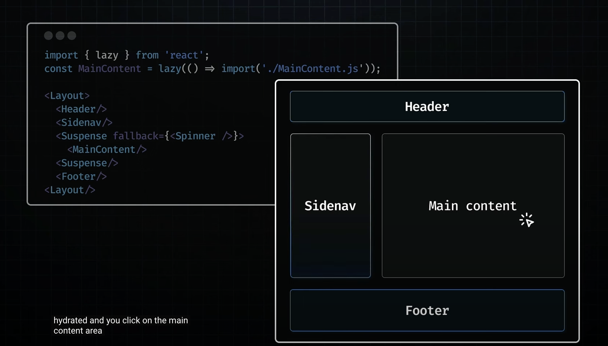

## Route Handlers

- We can also create custom request handlers for our routes using a feature called custom route handlers.
- Unlike page routes which will respond with HTML content, route handlers allow you to create Restful endpoints giving you full control over the response. we can perform CRUD operations with the database similar to node + express.js app.
- There is no overhead to create and configure a separate server. Nextjs provides everything you need out of the box.
- Route handlers are also great for making external API requests.
- Route handlers run server side ensuring that sensitive information like private keys remain secure and never gets shipped to the browser.
- Routing handlers are equivalent of API routes in Page router.
- Similar to page routes, route handlers must also be placed within the app folder.
- function name matching HTTP verb is another convention that we must follow.
- Similar to pge routes route handlers can be organized in folders and nested within sub folders. This allows for cleaner organization and easier management of routes. http://localhost:3000/dashboard/users http://localhost:3000/dashboard
- We have to create a Route.ts that exports HTTP verbs as functions [Demo](http://localhost:3000/hello)
- We have to be mindful about potential conflicts between page routes and route handlers. For example route.ts file and page.tsx file in the same profile folder. In this case route.ts file will handle the request by default. To avoid this conflict, we can move the route.ts file into a API directory.

## Handling GET Request

- data.ts inside comments is not a Nextjs convention. http://localhost:3000/comments
- Every route handler function receives the standard web request model object as a parameter. From this request object we are going to extract the JSON body specified as part of our request.
- For a POST request a 201 status of resource creating is more appropriate. If we were to return Response.Json object status would remain 200.

## Dynamic Route Handlers

- new folder id wrapped in square brackets is created.
- handler function receives 2 parameters request and context.
- Currently only value of context is params which is an object containing the dynamic route parameters for the current route. http://localhost:3000/comments/3

## Handling PATCH Request

- A patch request applies partial modifications to a resource.

## Handling DELETE Request

- Up until we have been defining the request type as the standard request API. However in the context of Nextjs the type we are actually dealing with in next request.
- Next request object provides convenient methods for managing query parameters with ease.

## Redirects in Route Handlers

- redirect is use to handle redirects. http://localhost:3000/comments/8
- in network tab request status it shows a 307 status code indicating a temporary redirect.

## Headers in Route Handlers

- HTTP headers represent the metadata associated with an API request and response. This metadata can be classified into 2 categories.
- First is request headers. These are sent by the client such as web browsers to the server. They contain essential information about the request, which helps the server understand and process it correctly.
- For example we have the "User-Agent" header which identifies the browser and operating system to the server. This is often used for browser specific content rendering and analytics. "Accept" header which indicates the content types like text, video or image formats that the client can process. It enables the server to deliver the resource in a format suitable for the client. Another common request header is the "Authorization" header used by the client to authenticate itself to the server. It carries credentials allowing controlled access to resources.
- Second is response headers. These are sent back from the server to the client. They provide information about the server and the data being sent in the response.
- For example, "Content-Type" header which indicates the media type of the response. It tells the client what data type of the returned content is such as text/html for HTML documents and application/json for JSON data.
- Headers from the headers functions are read only. To set headers you need to return a new response wih new header.

## Cookies in Route Handlers

- Cookies in Route Handlers
- Cookies are small pieces of data that a server sends to a user's web browser. The browser may send store the cookie and send it back to the same server with later requests.
- Cookies are mainly used for 3 purposes. 1 - Session management like login and shopping cards. 2 - Personalization like user preferences and themes. 3 - Tracking like recording and analyzing user behavior.
- To set a cookie first option is to return a new response using the setCookie header. To get the cookie we can use requestHeaders.
- Second option is to use cookies method provided by nextjs.
- Other than get and set "cookies()" function support other methods also like "has", "delete" etc.

## Caching in Route Handlers

- Route Handlers are cached by default when using the GET method with the response object in the Nextjs.
- By default value of dynamic is "auto" which attempts to cache as much as possible. We will set it to fore-dynamic which ensuring that handler is executed for each user request. If we re run "yarn build" and "yarn start" the time response will get updated on each request. We have successfully opted out of caching. Now besides the segment config option there are 3 other ways to opt out of caching for a route handler. 1 - Using the request method of the GET method. 2 - Employing dynamic functions like headers() and cookies(). 3 - Using any HTTP method other than GET

## Middleware

- Middleware in nextjs is a powerful feature that offers a robust way to intercept and control the flow of requests and responses within your applications
- It does this at the global level significantly enhancing features like redirection, URL rewrites, authentication, headers and cookies management and more
- Middleware allows us to specify paths where it will be active. Two main approaches: 1 - Custom matcher config, 2 - Conditional statements. http://localhost:3000/profile redirect to home page.
- Conditional statements can control middleware responses based on the request path.
- Apart from re-directions middleware also allows URL rewrites which is a useful tool for legacy URL support or SEO. http://localhost:3000/profile
- We can use cookies and headers in middleware.

## Client side rendering

- This method of rendering where component code is transformed into a user interface directly within the browser(the client) is called client side rendering(CSR)
- CSR quickly became the standard for SPAs with widespread adoption.

## Drawbacks for CSR

- Generating HTML that mainly contains a single div tag is not optimal for SEO as it provides little content for search engines to index. Large bundle size and a waterfall of network requests for API responses from deeply nested components may result in meaningful content not being rendered fast enough for a crawler to index it.
- Having the browser handle all the work such as fetching data, computing the UI and making the HTML interactive can slow things down. Users might see a blank screen or a loading spinner while the page loads
- Each new feature added to the application increases the size of the JavaScript bundle, prolonging the wait time for users to see the UI.
- To overcome these drawbacks of client side rendering, Modern frameworks like gatsby and nextjs pivoted towards server side solutions

## Server side solutions

- It significantly improves SEO because search engines can easily index the server rendered content
- Users can immediately see the HTMl content instead of a blank screen or loading spinner.
- Full interactivity of the page is on hold until the javascript bundle containing react itself along with the application specific code has been completely downloaded and executed by the browser. This important phase known as hydration is where the static HTML page initially served by the server is brought to live.

## hydration

- During hydration react takes control in the browser reconstruction the component tree in memory based on the static HTML that was served.
- It carefully plans the placement of interactive elements within this tree. Then React proceeds to proceeds to bind necessary Javascript logic to these elements. This involves initializing application state, attaching event handlers for actions such as clicks and mouse hovers and setting up any other dynamic functionalities required for a fully interactive user experience.

## Server side solutions

- SSR can be categorized into 2 strategies. 1 - Static site generation and 2 - Server side rendering.
- SSG occurs at build times when the application is deployed on the server. This results in pages that are already rendered and ready to be served. It is ideal for content that doesn't change often like Blog posts.
- SSR on the other hand renders page on-demand in response to user requests. It is suitable for personalized content like social media feeds where the HTML depends on the logged in user.
- SSR was a significant improvement over Client side rendering providing faster initial page loads and better SEO.

## Drawbacks of SSR

- You have to fetch everything before you can show anything. Components can not start rendering and the pause or wait while the data is still being loaded. If a component needs to fetch data from the database or another source like API this must complete before the server can begin rendering the page. This can delay the server response time to the browser as the server must finish collecting all necessary data before any part of the page can be sent to the client
- You have to load everything before you can hydrate anything. For successful hydration where React adds interactivity to the server rendered HTML, the component tree on browser must exactly match the server generated component tree. This means that all the JavaScript for the components must be loaded on the client before you can start hydrating any of them.
- You have to hydrate everything before you can interact with anything. React hydrates the component tree in a single pass meaning once it starts it won't stop until it finished with the entire tree. All components must be hydrated before you can interact with any of them.

## Suspense for SSR

- Use the "<suspense>" component to unlock 2 major SSR features. 1 - HTML streaming on the server and 2 - selective hydration on the client.
- With React 18 there is a new possibility. By wrapping a part of the page within suspense component, we instruct React it doesn't need to wait for the wrapped component to be fetched to start streaming the HTML for the rest of the page. React will send a placeholder like a loading spinner instead of the complete component. Once the server is ready with the data for the wrapped component, React sends additional HTML through the ongoing stream accompanied by an inline script tag containing the minimal Javascript needed to correctly position that HTML. As a result of this even before the full react library is loaded on the client side, the HTML for the wrapped component becomes visible to the user.
- So you don't have to fetch everything before you can show anything. If a particular section delays the initial HTML, it can be seamlessly integrated into the stream later. This is the essence of how Suspense facilitates server side HTML streaming.
- Until the Javascript for the wrapped component is loaded client side app hydration can not start. And if the Javascript bundle for the wrapped section is large, this could significantly delay the process. To mitigate this code splitting can be used.

## Code splitting

- Code splitting allows you to mark specific code segments as not immediately necessary for loading, signalling your bundler to segregate them into separate "<script>" tags.
- using React.lazy for code splitting enables you to separate the wrapped section's code from the primary javascript bundle.
- Javascript containing react and the code for the entire application, excluding the wrapped section can now be downloaded independently by the client without having to wait for the wrapped section's code.

## selective hydration on the client

- By wrapping the wrapped section with "<suspense>", you have indicated to React that it should not prevent the rest of the page from not just streaming but also from hydrating.
- This feature selective hydration allows for the hydration of sections as they become available, before the rest of the HTML and the javascript code can be fully downloaded.
- Thanks to selective hydration, a heavy piece of JS doesn't prevent the rest of the page from becoming interactive.
- Initially non interactive content streams in as HTML, the we ask react to hydrate. The Javascript code for the wrapped component isn't there yet but we can selectively hydrate other components. Wrapped component will be hydrated once it is loaded.
- Selective hydration offers solution to the issue: "The necessity to hydrate everything to interact with anything".
- React begins hydrating as soon as possible enabling interactions with elements like header, side navigation without waiting for the main component to be hydrated.
- The process is managed automatically by React.
- In scenarios where multiple components await hydration, React prioritizes hydration based on user interactions.
- For example side navigation was about to be hydrated and you clicked on the main component area. React will synchronously hydrate the clicked component during the capture phase of the click event. This ensures component is ready to respond immediately to the user interactions, side navigation will hydrate later on.

## Drawbacks of suspense SSR

- First even though JavaScript code is streamed from the browser asynchronously, eventually entire code for the web page must be downloaded by the user. As applications add more features, the amount of code user needs to download also grows. This leads to an important question: should users really have to download so much data.
- the current approach requires that all React components undergo hydration on the client side, irrespective of their actual need for interactivity. This process can inefficiently spend resources and extend the loading times and time to interactivity for the user, as their devices need to process and render components that might not even require client side interaction. This leads to question: should all components be hydrated, even those that don't need interactivity.
- In spite of server's superior capacity to handle intensive processing tasks, the bulk of Javascript execution still takes place on the user's device. This can slow down performance especially on devices that are not very powerful. This leads to question: should so much of the work be done on the user's device.

## The evolution of React

- CSR(Client side rendering) -> SSR(server side rendering) -> Suspense for SSR
- Suspense for SSR brought us closer to a seamless rendering experience.
- Challenges faced : 1- Increased bundle sizes leading to excessive download for the users. 2- Unnecessary hydration delaying interactivity. 3- extensive client side processing that could result in poor performance.

## React Server Components (RSC)

- RSC represent a new architecture designed by the React team.
- This approach aims to leverage the strengths of both server and client environments, optimizing for efficiency, load times and interactivity.
- The architecture introduces a dual component model : 1- client components and 2- server components. This distinction is not based on the functionality of the components but rather on where they execute and the specific environments they are designed to interact with.

## Client components

- Client components are the familiar React components we have been using.
- They are typically rendered on the client side CSR but they can also be rendered to HTML on the server(SSR) allowing users to immediately see the page's HTML content rather than a blank screen.
- Components that are primarily run on the client but can (And should) also be executed on the server side as an optimization strategy.
- Client components have access to the client environment such as browser allowing them to use state, effects and event listeners to handle interactivity and also access browser exclusive APIS like geolocation or localStorage allowing you to build UI for specific use cases.
- In fact the term client component doesn't signify anything new. It simply helps differentiate these components from the newly introduced Server components.

## Server components

- Client components have access to the client environment
